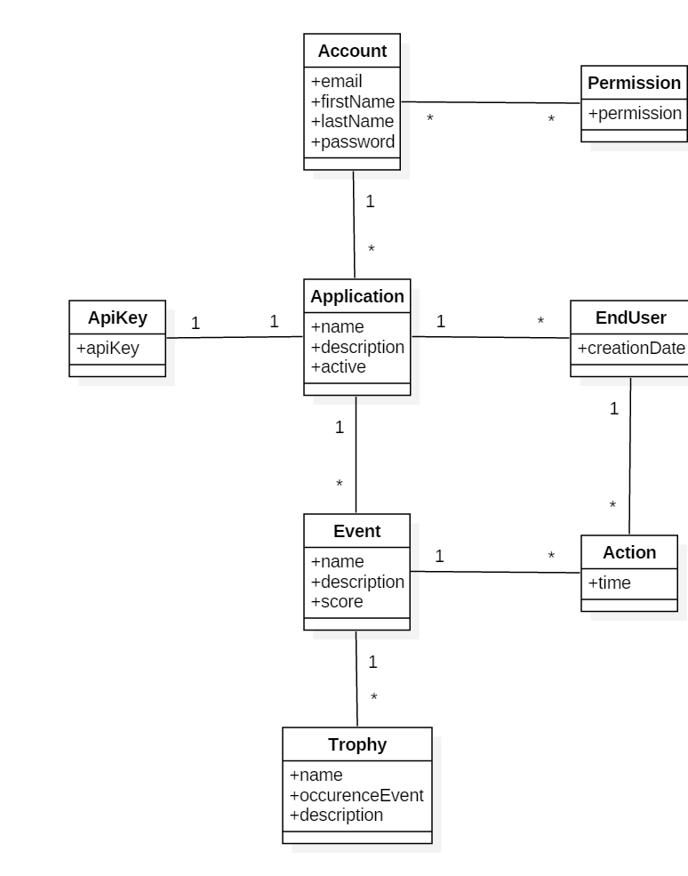
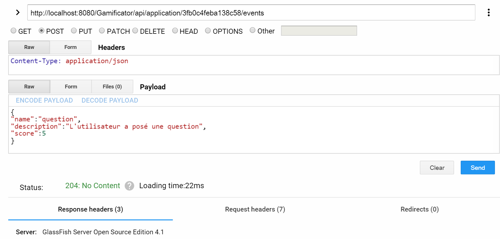

# AMT Project Repository

Welcome to the home of the AMT Project. This is where you will find information about the project (specifications, evaluation, etc.).

## Author

Bastien Rouiller

## Documentation

## How to use this repo

### What should we do with this repo?

One (and only one) person in every group should fork this repository. All group members should then clone the fork and use it as a shared code base repository.

### How do we keep our fork in sync with this repo?

From time to time, we will add content in the repo (update the README.md file, add directories and files, etc.). You will want to fetch these updates, following the standard "fetch upstream" technique. If you do not remember how it works (from the RES course), refer to this [documentation](https://help.github.com/articles/syncing-a-fork/). 

## Demo

### Account Creation

### REST API testing - Application creation,EndUser, Event, Action, Trophy
See live demo

### Watch End User's scoring and trophy awards

## About the project

### Introduction

In the project, we will design and build a **generic gamification platform**. In other words, we will create a service that will be used by other developers.

To illustrate the idea, think about [stackoverflow.com](http://www.stackoverflow.com). This community-oriented application uses gamification techniques to engage users and increase their active participation. Users get points, badges and other rewards when they ask questions and when they provide answers. Users build up a reputation and grow up the ranks of the community.

How did the stackoverflow developers implement these gamification features? We cannot know for sure, but we can think of two models:

* **They have done everything themselves**. If that is the case, then they had to do a lot of design and implementation in a topic that is very specific and a bit outside of their core business. That extra effort has certainly taken time and negatively affected their time-to-market.

* **They have used a third-party gamification platform** (or gamification engine) and integrated it with their service. In that model, the external platform deals with points, badges, leader boards, etc. The platform provides APIs so that stackoverflow developers can notify the platform when "interesting events" happen within their app (e.g. a user has posted a new question). The platform also provides UIs so that stackoverflow developers can define rules to trigger gamification mechanisms (e.g. *"if a user has answered a question, then award him 10 reputation points."*).

The goal of the project will be to build a simple gamification platform to support the second model.

### Part 1

In the first part of the project, we will apply techniques presented in the course to build the foundation of the gamification platform. We will implement a simple domain model to deal with user accounts, roles, applications and API keys. We will also implement a web UI to manage these elements.

The specifications are available [here](specifications/part1/).

### Part 2

In the second part of the project, we will design the gamification domain model. This is where you will have to define and implement game mechanisms (e.g. badges, reputation scores, leader boards, etc.). This is also where you will have to find a ways to make a connection between what happens within the gamified application (e.g. a stackoverflow user has answered a question) and what happens within the gamification platform (e.g. a badge is awarded to that user). In the second part, we will focus more on the design and implementation of a REST API than on the implementation of a web UI. 

The specifications are not available yet. They will be published [here](specifications/part2).

### Part 3

In the third part of the project, we will **validate the gamification engine by using it from a particular application**. 

This will be the most creative part of the project, where every group will have to **select an application domain** (business, commerce, education, travel, photography, etc.) and implement a proof-of-concept system. To do that, each group will have the choice of **either building a simple application** (e.g. a simplified Instagram application) **or integrating an existing third-party service** (e.g. the real Instagram service). In both cases, the group will have to invoke the gamification APIs from the gamified application, configure rules and design a demonstration scenario.

The specifications are not available yet. They will be published [here](specifications/part3).
